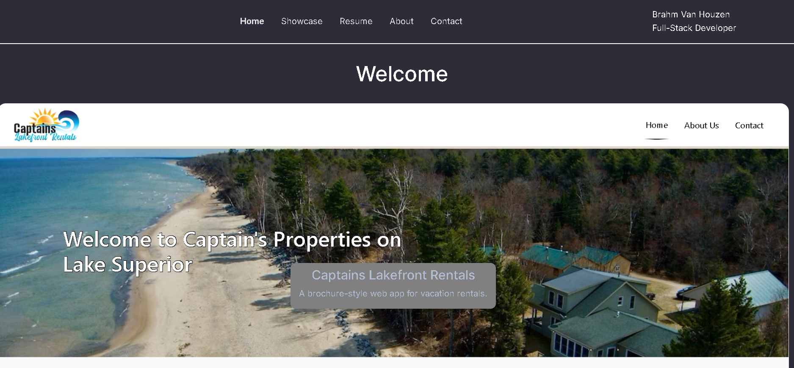

# BrahmVanHouzen

  

  
  ## Description 

  Link to Deployed app: [brahmvanhouzen.studio](https://brahmvanhouzen.studio) \
  Link to Github repo: [BrahmVanH/BrahmVanHouzen](https://github.com/BrahmVanH/BrahmVanHouzen)
  
  
  My personal website containing my portfolio, contact infromation, and a little about myself."
  
  ## Table of Contents

  ⋆[Installation](#Installation)
  ⋆[Usage](#Usage)
  ⋆[Credits](#Credits)
  ⋆[License](#License)
  ⋆[Features](#Features)
  ⋆[Contributions](#Contributions)
  ⋆[Test](#Contributions)

  ## Installation 

  N/A

  ## Usage

  N/A

  ## Credits 

  N/A

  ## License

  (https://opensource.org/licenses/MIT)
  

  ## Features

  N/A

  ## Contributions

  N/A

  ## Test

  N/A

  ## Questions

  If you have any questions about the project you can reach out to me via email or GitHub with the information below. 

  >Email: brahm@brahmvanhouzen.studio

  >GitHub: [BrahmVanH](https://github.com/BrahmVanH)

